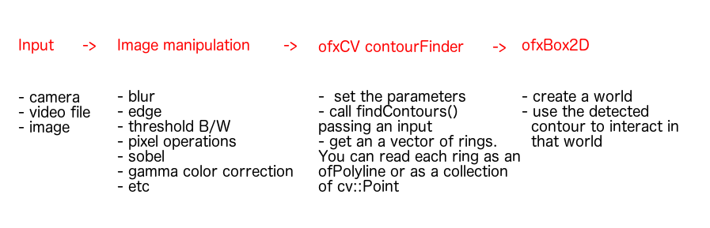

# Experimental Computer Vision

In this course we are going to cover first the principles of computer vision, and then we are going to apply them to different camera capture techniques.

## 01
*Description*:

Introduction to computer vision. We read through the [computer visionchapter on the ofBook](https://openframeworks.cc/ofBook/chapters/image_processing_computer_vision.html).

*Keywords*:

`getBrightness()`, image types, image containers, openCV, point processing operations, background subtraction, frame differencing, absolute frame differencing

Applications:
Besides that one that come with the introductio chapter (that are in this repository), have a look at this [example on ofxCV](https://github.com/kylemcdonald/ofxCv/tree/master/example-background) and the example `examples/computer-vision`.

Exercises:
- Download [ofxCV](https://github.com/kylemcdonald/ofxCv/) in your `addons` folder, we will have a look to some of the examples in the next lesson.
- Take two images and perform operations with them (addition, multiplication, division). Add a GUI, add parameter that change the behaviour of your mixer. Add color picker wheel, select only certain color in the image.

## 02

*Description*:

Keywords: Blur filter, sobel, contour detection. Box2D, ofPolyline, ofPath, ofVboMesh, `ofxCv::ContourFinder`, [canny edge detection](https://en.wikipedia.org/wiki/Canny_edge_detector), `ofPolyline`, blur filter

Exercise:
- Start to take notes of the classes that you use in your code, the methods called, the examples where you have seen them, the sketches where you have already used it.
- Start to take notes of the errors that your IDE gives (hopefully just occasionally) to you.
- take a video file, apply contour detection and create a mesh with it (see `02-filters-and-contours`)
- Read the paragraph "Contour Games" in the [ofBook](https://openframeworks.cc/ofBook/chapters/image_processing_computer_vision.html), make an interactive application using contour detection and box2D

Exercise:
- Make an interactive application that uses contours. It can use the camera or a video file. It does not need to be a game.

Other facultative exercises:

- Go back to the `openCVExample` in the `examples/computer_vision` folder, or open the example `example-background` in the `ofxCv` addon, we have seen both in the previous lesson.
- Have a look at the `example-difference`, take a look closely to the methods `copy`, `mean`, `diffMean`.
- Have a look at the example `example-contour-tracking`, can you think to a possible drawing machine driven by a video source?
- In the example `example-contour-color` it is shown how to detect a contour by color. Make an interactive application that uses this feature.
- Make a copy of the `example-contours-following`. Create your own `Glow` class and change the draw method.

Examples in ofxCv and in this repository, in order: `example-contour-basic`, , `example-blur`, `example-edge`, `example-contour-tracking`, `02-filters-and-contours`, `example-contour-color`, `02-FaceTracker-box2D`, `example-contours-following`, `example-difference`.

## 03

Exercises:
- Build a slit scanner. Read the last part of the [ofBook](https://openframeworks.cc/ofBook/chapters/image_processing_computer_vision.html)
- Find other addons

## 04

- Kinect example